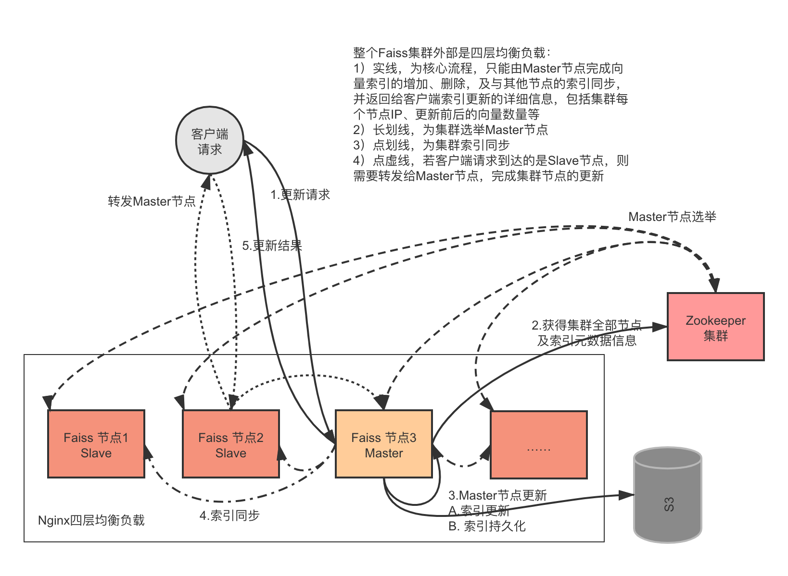

# cap faiss
- 1 概述
- 2 工程结构
- 3 sure部署
- 4 压力测试
- 5 项目
- 参考

# 1 概述
分布式实时Faiss召回系统


# 2 grpc
```shell script
python -m grpc_tools.protoc -I ./ --python_out=./ --grpc_python_out=./ compute.proto
```
```shell script
python -m grpc_tools.protoc -I ./ --python_out=./ --grpc_python_out=./ syncindex.proto
```

# 2 sure部署
具体参考 [部署](doc/02.部署.md)

# 参考